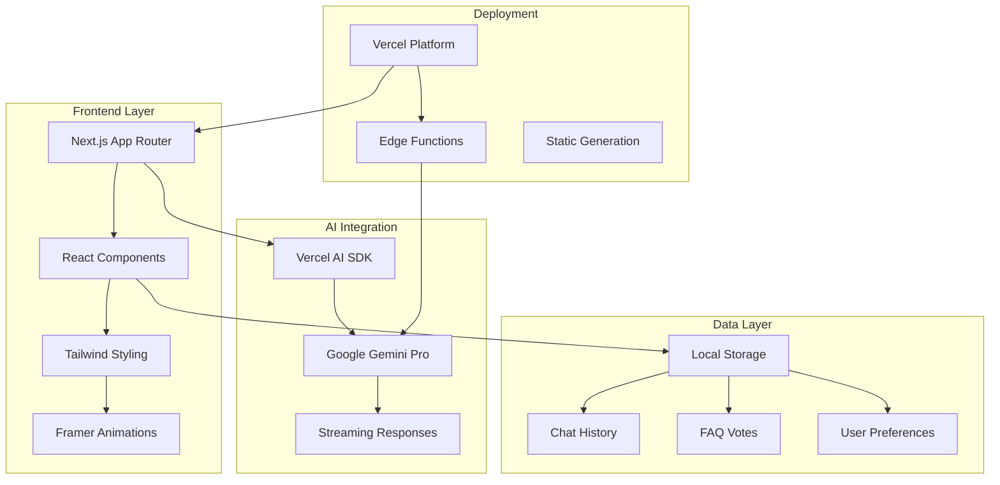
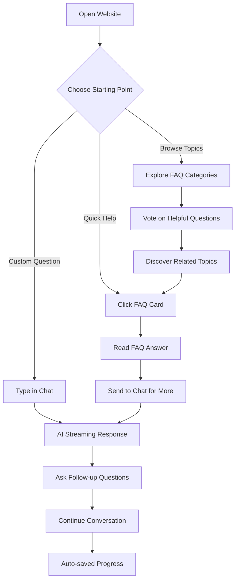

<div align="center"><a name="readme-top"></a>

# 🤖 AI Hackathon Festival 2025 Assistant<br/><h3>Interactive AI Assistant with Community-Driven FAQ</h3>

A modern, full-featured AI assistant website designed to help students and mentors with all aspects of the AI Hackathon Festival 2025.<br/>
Features a full-screen chat interface with Google Gemini Pro and community-driven FAQ voting system.<br/>
One-click **FREE** deployment on Vercel.

[](https://github.com/ChanMeng666/ai-hackathon-assistant-2025)

<!-- SHIELD GROUP -->

[![][github-release-shield]][github-release-link]
[![][vercel-shield]][vercel-link]
[![][github-stars-shield]][github-stars-link]
[![][github-forks-shield]][github-forks-link]
[![][github-license-shield]][github-license-link]

**Share AI Hackathon Assistant**

[![][share-x-shield]][share-x-link]
[![][share-linkedin-shield]][share-linkedin-link]
[![][share-reddit-shield]][share-reddit-link]

<sup>🌟 Pioneering the future of AI-powered event assistance. Built for hackathon participants and mentors.</sup>

</div>

## 📸 Project Screenshots

> [!TIP]
> Experience the full-screen AI chat interface and community-driven FAQ system in action.

<div align="center">
  
  <p><em>Main Interface - AI Chat (70%) + FAQ Sidebar (30%)</em></p>
</div>

<div align="center">
  
  
  <p><em>Mobile Views - Responsive Tabbed Interface</em></p>
</div>

**Tech Stack Badges:**

<div align="center">

 
 
 
 
 
 

</div>

> [!IMPORTANT]
> This project demonstrates modern full-stack development with Next.js 15, TypeScript, and Google Gemini Pro AI. It combines full-screen chat interface with community-driven FAQ voting system to provide comprehensive hackathon support.

<details>
<summary><kbd>📑 Table of Contents</kbd></summary>

#### TOC

- [🤖 AI Hackathon Festival 2025 AssistantInteractive AI Assistant with Community-Driven FAQ](#-ai-hackathon-festival-2025-assistantinteractive-ai-assistant-with-community-driven-faq)
  - [📸 Project Screenshots](#-project-screenshots)
      - [TOC](#toc)
      - [](#)
  - [✨ Key Features](#-key-features)
    - [`1` Full-Screen AI Chat Experience](#1-full-screen-ai-chat-experience)
    - [`2` Community-Driven FAQ System](#2-community-driven-faq-system)
    - [`*` Additional Features](#-additional-features)
  - [🛠️ Tech Stack](#️-tech-stack)
  - [🏗️ Architecture](#️-architecture)
    - [Component Architecture](#component-architecture)
  - [🚀 Getting Started](#-getting-started)
    - [Prerequisites](#prerequisites)
    - [Quick Installation](#quick-installation)
    - [Environment Setup](#environment-setup)
  - [🛳 Deployment](#-deployment)
    - [`A` One-Click Deployment](#a-one-click-deployment)
    - [`B` Manual Deployment](#b-manual-deployment)
    - [`C` Environment Variables](#c-environment-variables)
  - [📖 Usage Guide](#-usage-guide)
    - [Main Interface](#main-interface)
    - [AI Chat Features](#ai-chat-features)
    - [FAQ Voting System](#faq-voting-system)
    - [For Students and Mentors](#for-students-and-mentors)
    - [Interaction Flow](#interaction-flow)
  - [🔌 Customization](#-customization)
    - [Adding New Preset Questions](#adding-new-preset-questions)
    - [Modifying AI Behavior](#modifying-ai-behavior)
    - [Styling and Theming](#styling-and-theming)
    - [Adding New Categories](#adding-new-categories)
  - [🤝 Contributing](#-contributing)
    - [Development Process](#development-process)
    - [Contribution Areas](#contribution-areas)
    - [Code of Conduct](#code-of-conduct)
  - [📄 License](#-license)
  - [👥 Team](#-team)

####

<br/>

</details>

## ✨ Key Features

### `1` Full-Screen AI Chat Experience

Transform your hackathon experience with our revolutionary AI assistant powered by Google Gemini Pro. Unlike traditional popup chatbots, our full-screen interface puts AI conversation at the center of your experience.

Key capabilities include:
- 🚀 **Real-time Streaming**: Character-by-character live responses
- 🎯 **Smart Suggestions**: Pre-populated question cards for quick start
- 💬 **Multi-line Input**: Auto-resizing textarea with Shift+Enter support
- 🔄 **Persistent History**: 50 messages saved locally across sessions
- ⚡ **Instant Integration**: FAQ questions flow seamlessly into chat

> [!TIP]
> Try asking: "How do I form a team for the hackathon?" or click any FAQ card to see the instant integration in action.

[![][back-to-top]](#readme-top)

### `2` Community-Driven FAQ System

Revolutionary FAQ management that evolves with your community. Users vote on helpful questions, automatically surfacing the most valuable content to the top.

<div align="center">
  
  <p><em>Community Voting in Action - Questions ranked by helpfulness</em></p>
</div>

**Available Features:**
- **Voting System**: 👍 Helpful / 👎 Not helpful with real-time sorting
- **Smart Search**: Find questions by keywords in title or content
- **Category Filter**: Browse by Event Info, Teams, Technical, etc.
- **View Tracking**: Popular questions rise to the top naturally
- **One-Click Chat**: Send any FAQ directly to AI for follow-up

[![][back-to-top]](#readme-top)

### `*` Additional Features

Beyond the core functionality, this project includes:

- [x] 💨 **Instant Setup**: Deploy in under 1 minute with one-click Vercel deployment
- [x] 🌐 **Responsive Design**: Perfect experience on desktop (70/30 split) and mobile (tabs)
- [x] 🔒 **Privacy First**: All chat data stored locally, no server persistence
- [x] 💎 **Modern Animations**: Framer Motion powered micro-interactions
- [x] 🎨 **Beautiful UI**: shadcn/ui components with Tailwind CSS
- [x] 📊 **Real-time Updates**: Live vote counts and instant FAQ integration
- [x] 🔌 **Extensible**: Easy to add new question categories and features
- [x] ⚡ **Performance Optimized**: Lazy loading, efficient state management

> ✨ Built specifically for the AI Hackathon Festival 2025 with hackathon-specific Q&A database.

<div align="right">

[![][back-to-top]](#readme-top)

</div>

## 🛠️ Tech Stack

<div align="center">
  <table>
    <tr>
      <td align="center" width="96">
        
        <br>Next.js 15
      </td>
      <td align="center" width="96">
        
        <br>React 18
      </td>
      <td align="center" width="96">
        
        <br>TypeScript 5
      </td>
      <td align="center" width="96">
        
        <br>Tailwind CSS
      </td>
      <td align="center" width="96">
        
        <br>Gemini Pro
      </td>
      <td align="center" width="96">
        
        <br>Vercel
      </td>
    </tr>
  </table>
</div>

**Frontend Stack:**
- **Framework**: Next.js 15.4.0 with App Router
- **Language**: TypeScript for type safety
- **Styling**: Tailwind CSS v3 + Framer Motion v12
- **UI Components**: shadcn/ui + Radix UI primitives
- **State Management**: React hooks + Local Storage

**AI Integration:**
- **AI SDK**: Vercel AI SDK v4.3.19 for streaming
- **AI Provider**: Google Gemini Pro via @ai-sdk/google
- **Features**: Real-time streaming, context awareness
- **Performance**: Optimized for low-latency responses

**DevOps & Performance:**
- **Deployment**: Vercel with automatic CI/CD
- **Performance**: Lazy loading, efficient bundling
- **Monitoring**: Built-in error boundaries
- **SEO**: Next.js App Router with metadata

> [!TIP]
> Each technology was carefully selected for developer experience, performance, and production readiness.

## 🏗️ Architecture



### Component Architecture

```
src/
├── app/                    # Next.js App Router
│   ├── api/chat/          # AI streaming endpoint
│   ├── globals.css        # Global styles
│   ├── layout.tsx         # Root layout
│   └── page.tsx           # Main interface
├── components/            # React components
│   ├── chat/             # Chat interface
│   ├── faq/              # FAQ system
│   ├── chatbot/          # Shared components
│   └── ui/               # Base UI components
├── hooks/                # Custom React hooks
│   └── use-faq-voting.ts # FAQ voting logic
├── lib/                  # Utilities
│   └── utils.ts          # Helper functions
└── public/               # Static assets
```

## 🚀 Getting Started

### Prerequisites

> [!IMPORTANT]
> Ensure you have the following installed:

- Node.js 18.17+ ([Download](https://nodejs.org/))
- npm/yarn/pnpm package manager
- Google Gemini API key ([Get one here](https://aistudio.google.com/app/apikey))

### Quick Installation

**1. Clone Repository**

```bash
git clone https://github.com/ChanMeng666/ai-hackathon-assistant-2025.git
cd ai-hackathon-assistant-2025
```

**2. Install Dependencies**

```bash
# Using npm
npm install

# Using yarn
yarn install

# Using pnpm (recommended)
pnpm install
```

**3. Environment Setup**

```bash
# Copy environment template
cp .env.example .env.local

# Edit environment variables
nano .env.local
```

### Environment Setup

Create `.env.local` file with the following variables:

```bash
# Required: Google Gemini Pro API Key
GOOGLE_GENERATIVE_AI_API_KEY=your_google_gemini_api_key_here

# Optional: Application settings
NODE_ENV=development
NEXTAUTH_URL=http://localhost:3000
NEXTAUTH_SECRET=your_secret_key_here
```

> [!TIP]
> Get your Google Gemini API key from [Google AI Studio](https://aistudio.google.com/app/apikey). Use `openssl rand -base64 32` to generate secure random secrets.

**4. Start Development**

```bash
npm run dev
```

🎉 **Success!** Open [http://localhost:3000](http://localhost:3000) to view the application.

## 🛳 Deployment

> [!IMPORTANT]
> Choose the deployment strategy that best fits your needs. Vercel is recommended for seamless Next.js deployment.

### `A` One-Click Deployment

**Deploy to Vercel (Recommended)**

[](https://vercel.com/new/clone?repository-url=https%3A%2F%2Fgithub.com%2FChanMeng666%2Fai-hackathon-assistant-2025)

### `B` Manual Deployment

**Vercel CLI:**

```bash
# Install Vercel CLI
npm i -g vercel

# Deploy
vercel --prod
```

**Other Platforms:**

<div align="center">

|           Deploy with Netlify            |                     Deploy with Railway                      |
| :---------------------------------------: | :-----------------------------------------------------------: |
| [](https://app.netlify.com/start/deploy?repository=https://github.com/ChanMeng666/ai-hackathon-assistant-2025) | [](https://railway.app/new/template?template=https://github.com/ChanMeng666/ai-hackathon-assistant-2025) |

</div>

### `C` Environment Variables

> [!WARNING]
> Never commit sensitive environment variables to version control. Use secure secret management in production.

| Variable | Description | Required | Example |
|----------|-------------|----------|---------|
| `GOOGLE_GENERATIVE_AI_API_KEY` | Google Gemini Pro API key | ✅ | `AIza...` |
| `NEXTAUTH_SECRET` | Session encryption secret | 🔶 | `generated-secret-key` |
| `NEXTAUTH_URL` | Application URL | 🔶 | `https://your-domain.vercel.app` |
| `NODE_ENV` | Environment mode | 🔶 | `production` |

> [!NOTE]
> ✅ Required, 🔶 Optional

## 📖 Usage Guide

### Main Interface

**Desktop Experience:**
- **AI Chat (70%)**: Full-screen conversational interface
- **FAQ Sidebar (30%)**: Community-driven question voting
- **Seamless Integration**: Click FAQ → flows into chat instantly

**Mobile Experience:**
- **Tab Navigation**: Swipe between Chat and FAQ views
- **Optimized Layout**: Full-screen on smaller devices
- **Gesture Support**: Native mobile interactions

<div align="center">
  
  <p><em>Desktop: AI Chat dominates with FAQ sidebar for quick access</em></p>
</div>

### AI Chat Features

**Getting Started:**

1. **Choose Your Path**: 
   - Click suggestion cards for instant common questions
   - Type custom questions in natural language
   - Send FAQ questions for detailed follow-up

2. **Advanced Features**:
   - **Multi-line Input**: Use Shift+Enter for line breaks
   - **Context Awareness**: AI remembers conversation history
   - **Instant Responses**: Real-time streaming from Google Gemini Pro

**Example Interactions:**
```
User: "How do I form a team?"
AI: [Streams detailed team formation guidance]

User: "What if I don't have technical skills?"
AI: [Provides specific advice for non-technical participants]
```

### FAQ Voting System

**Community-Driven Ranking:**

| Feature | Description | Benefit |
|---------|-------------|---------|
| 👍 **Upvote** | Mark questions as helpful | Valuable content rises to top |
| 👎 **Downvote** | Flag less useful content | Improves overall quality |
| 🔍 **Search** | Find by keywords | Quick access to specific topics |
| 🏷️ **Filter** | Browse by category | Organized content discovery |
| 💬 **Send to Chat** | One-click integration | Seamless AI follow-up |

**Available Categories:**
- 📅 **Event Information**: Dates, schedule, logistics
- 👥 **Team Formation**: Finding teammates, roles, composition
- ⚙️ **Technical Details**: AI requirements, datasets, tools
- 🏆 **Awards & Judging**: Criteria, prizes, evaluation process
- 🎯 **Mentorship**: Getting help, Discord, support channels

### For Students and Mentors

**Students can get help with:**
- 🎯 **Getting Started**: First-time hackathon guidance
- 👥 **Team Building**: Finding the right teammates
- 💡 **Idea Development**: Brainstorming and validation
- ⚙️ **Technical Setup**: Tools, APIs, development environment

**Mentors can assist with:**
- 📚 **Resource Sharing**: Point to useful FAQ answers
- 🎓 **Teaching Moments**: Use chat for detailed explanations
- 🔍 **Quick References**: Browse FAQ for common student questions
- 💬 **Office Hours**: Efficient Q&A through familiar interface

### Interaction Flow



> [!TIP]
> **Pro Tip**: Start with FAQ browsing to discover common topics, then use chat for personalized follow-up questions. Your votes help improve the experience for everyone!

## 🔌 Customization

### Adding New Preset Questions

Extend the FAQ database by editing `components/chatbot/preset-questions.ts`:

```typescript
{
  id: 'unique-id',
  category: 'event-info', // Available: event-info, teams, technical, schedule, mentors, awards, logistics
  question: 'Your question here?',
  answer: 'The detailed answer with helpful information...'
}
```

### Modifying AI Behavior

Customize the AI assistant's personality and knowledge by updating the system prompt in `app/api/chat/route.ts`:

```typescript
const systemPrompt = `You are an AI assistant for the AI Hackathon Festival 2025...
- Add specific instructions
- Include domain knowledge
- Set response tone and style
`;
```

### Styling and Theming

**Global Styles:**
```css
/* app/globals.css */
:root {
  --primary-color: #4F46E5;
  --secondary-color: #059669;
  /* Add custom CSS variables */
}
```

**Component Styling:**
- Individual components use Tailwind CSS classes
- Theme colors defined in `tailwind.config.js`
- Animations powered by Framer Motion

### Adding New Categories

1. **Update Types** (`components/chatbot/types.ts`):
```typescript
export type QuestionCategory = 'event-info' | 'teams' | 'your-new-category';
```

2. **Add Display Name** (`components/chatbot/preset-questions.ts`):
```typescript
const categoryNames = {
  'your-new-category': 'Your Category Name'
};
```

3. **Create Questions** with the new category value.

## 🤝 Contributing

We welcome contributions! Here's how you can help improve this project:

### Development Process

**1. Fork & Setup:**

```bash
# Fork the repository on GitHub
git clone https://github.com/YOUR_USERNAME/ai-hackathon-assistant-2025.git
cd ai-hackathon-assistant-2025

# Install dependencies
pnpm install

# Create environment file
cp .env.example .env.local
# Add your API keys
```

**2. Create Feature Branch:**

```bash
git checkout -b feature/amazing-new-feature
```

**3. Development Guidelines:**

- ✅ Follow TypeScript best practices
- ✅ Add comprehensive tests for new features
- ✅ Use consistent code formatting (Prettier + ESLint)
- ✅ Include JSDoc comments for public APIs
- ✅ Follow accessibility guidelines (WCAG 2.1)

**4. Submit Pull Request:**

- Provide clear description of changes
- Include screenshots for UI changes
- Reference related issues
- Ensure all checks pass

### Contribution Areas

| Type | Description | Examples |
|------|-------------|----------|
| 🐛 **Bug Fixes** | Fix existing issues | API errors, UI glitches, performance |
| ✨ **New Features** | Add functionality | New categories, UI improvements |
| 📚 **Documentation** | Improve guides | README updates, code comments |
| 🎨 **Design** | Visual improvements | Better animations, color schemes |
| ⚡ **Performance** | Optimize speed | Bundle size, loading times |

### Code of Conduct

- Be respectful and inclusive
- Provide constructive feedback
- Help newcomers learn and contribute
- Focus on the project's goals

## 📄 License

This project is licensed under the MIT License - see the [LICENSE](LICENSE) file for details.

**Open Source Benefits:**
- ✅ Commercial use allowed
- ✅ Modification allowed  
- ✅ Distribution allowed
- ✅ Private use allowed

## 👥 Team

<div align="center">
  <table>
    <tr>
      <td align="center">
        <a href="https://github.com/ChanMeng666">
          
          <br />
          <sub><b>Chan Meng</b></sub>
        </a>
        <br />
        <small>Creator & Lead Developer</small>
      </td>
    </tr>
  </table>
</div>

**Author Contact:**
- 🌐 **Website**: [chanmeng.live](https://2d-portfolio-eta.vercel.app/)
- 💼 **LinkedIn**: [chanmeng666](https://www.linkedin.com/in/chanmeng666/)
- 📧 **Email**: [chanmeng.dev@gmail.com](mailto:chanmeng.dev@gmail.com)
- 🔗 **GitHub**: [ChanMeng666](https://github.com/ChanMeng666)

---

<div align="center">
<strong>🚀 Building the Future of AI-Powered Event Assistance 🌟</strong>
<br/>
<em>Empowering hackathon participants and mentors worldwide</em>
<br/><br/>

⭐ **Star us on GitHub** • 📖 **Read the Documentation** • 🐛 **Report Issues** • 💡 **Request Features** • 🤝 **Contribute**

<br/><br/>

**Made with ❤️ by the AI Hackathon Assistant team**

[](https://github.com/ChanMeng666/ai-hackathon-assistant-2025/stargazers)
[](https://github.com/ChanMeng666/ai-hackathon-assistant-2025/forks)
[](https://github.com/ChanMeng666)

</div>

---

<!-- LINK DEFINITIONS -->

[back-to-top]: https://img.shields.io/badge/-BACK_TO_TOP-151515?style=flat-square

<!-- GitHub Links -->
[github-release-link]: https://github.com/ChanMeng666/ai-hackathon-assistant-2025/releases
[github-stars-link]: https://github.com/ChanMeng666/ai-hackathon-assistant-2025/stargazers
[github-forks-link]: https://github.com/ChanMeng666/ai-hackathon-assistant-2025/forks
[github-license-link]: https://github.com/ChanMeng666/ai-hackathon-assistant-2025/blob/main/LICENSE

<!-- Deployment Links -->
[vercel-link]: https://ai-hackathon-assistant-2025.vercel.app

<!-- Shield Badges -->
[github-release-shield]: https://img.shields.io/github/v/release/ChanMeng666/ai-hackathon-assistant-2025?color=369eff&labelColor=black&logo=github&style=flat-square
[vercel-shield]: https://img.shields.io/badge/vercel-online-55b467?labelColor=black&logo=vercel&style=flat-square
[github-stars-shield]: https://img.shields.io/github/stars/ChanMeng666/ai-hackathon-assistant-2025?color=ffcb47&labelColor=black&style=flat-square
[github-forks-shield]: https://img.shields.io/github/forks/ChanMeng666/ai-hackathon-assistant-2025?color=8ae8ff&labelColor=black&style=flat-square
[github-license-shield]: https://img.shields.io/badge/license-MIT-white?labelColor=black&style=flat-square

<!-- Social Share Links -->
[share-x-link]: https://x.com/intent/tweet?hashtags=opensource,ai,hackathon&text=Check%20out%20this%20amazing%20AI%20hackathon%20assistant&url=https%3A%2F%2Fgithub.com%2FChanMeng666%2Fai-hackathon-assistant-2025
[share-linkedin-link]: https://linkedin.com/sharing/share-offsite/?url=https://github.com/ChanMeng666/ai-hackathon-assistant-2025
[share-reddit-link]: https://www.reddit.com/submit?title=AI%20Hackathon%20Assistant%202025&url=https%3A%2F%2Fgithub.com%2FChanMeng666%2Fai-hackathon-assistant-2025

[share-x-shield]: https://img.shields.io/badge/-share%20on%20x-black?labelColor=black&logo=x&logoColor=white&style=flat-square
[share-linkedin-shield]: https://img.shields.io/badge/-share%20on%20linkedin-black?labelColor=black&logo=linkedin&logoColor=white&style=flat-square
[share-reddit-shield]: https://img.shields.io/badge/-share%20on%20reddit-black?labelColor=black&logo=reddit&logoColor=white&style=flat-square
